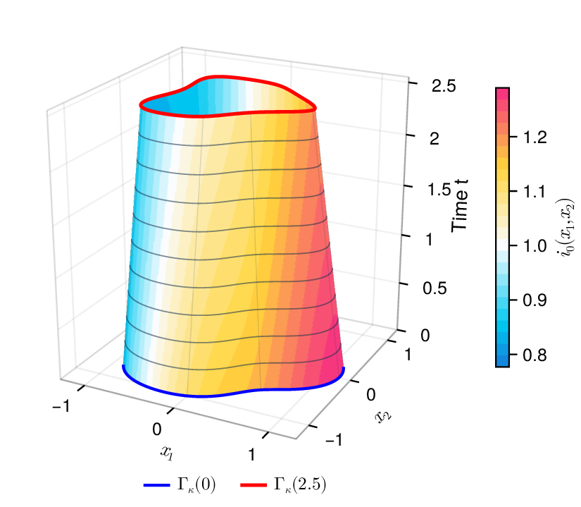
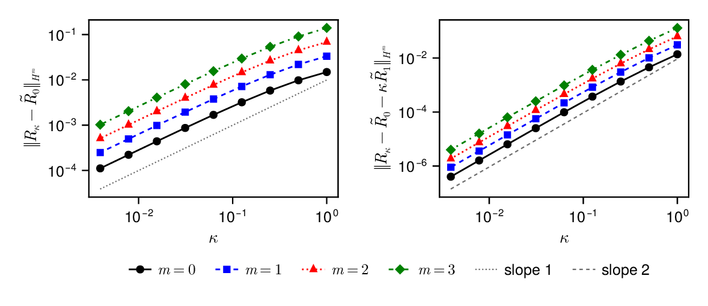
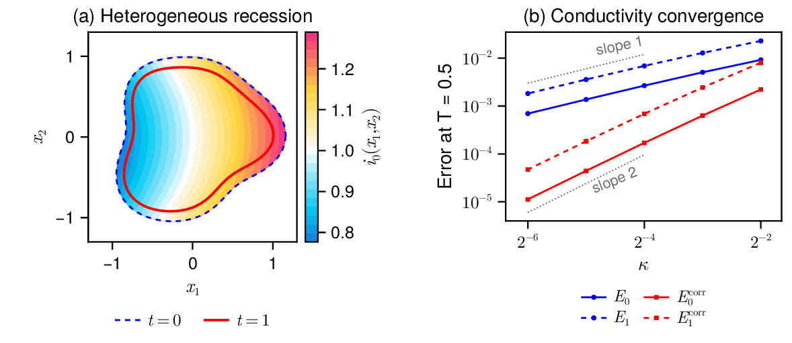
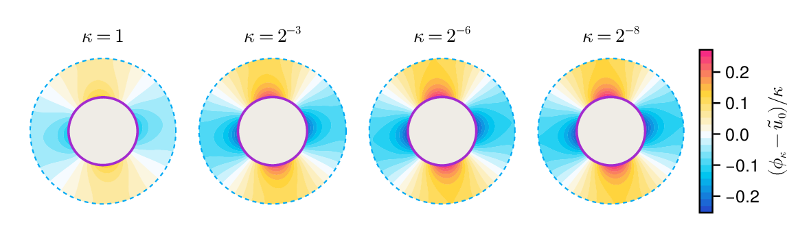

# Low-conductivity limit for a nonlinear free boundary problem in corrosion modeling

**Daniel Fernández · Denilson Menezes**

[Reproduce the results](REPRODUCING.md) · [Heterogeneous experiment](HETEROGENEOUS.md) · [Data](data/README.md) · [Citation](CITATION.cff)

[](figures/paper/fig_evolution3d.pdf)

*A space-time view of the computed evolution. Height represents time; each
horizontal section is a planar interface. [Open the PDF](figures/paper/fig_evolution3d.pdf).*

A metal inclusion dissolves inside an insulated container. A harmonic
electric potential couples the moving interface to spatially varying
corrosion current $i_0(x)$ and mixed potential $\phi_{\mathrm{eq}}(x)$.
The net electrical current balances over the surface, while the positive
dissolution current removes metal.

The paper proves local well-posedness and a low-conductivity limit with
normal speed $V_\nu=\beta i_0(x)$. On smooth time intervals the interface
error is $O(\kappa)$. Its first electrical correction satisfies a linear
transport equation; subtracting it leaves an $O(\kappa^2)$ remainder.
The correction redistributes dissolution without changing its total on the
same interface at first order.

## Experiments and figures

Two experiments test the asymptotic rates, with independent spatial and
temporal refinement:

| Experiment | Reference and purpose |
| --- | --- |
| **Receding disk** | Constant $i_0$, an exact limiting radius, and an explicit first corrector. Tests interface and bulk convergence. |
| **Heterogeneous lobed interface** | Nonconstant $i_0$, an asymmetric nonconvex interface, and unequal reaction slopes. Uses a refined numerical reference and exercises the transported corrector. |

[](figures/paper/fig_corrector.pdf)

*Disk benchmark: interface displacement and corrected remainder.
[PDF](figures/paper/fig_corrector.pdf) · [Conductivity table](tables/conductivity_sweep.tex)*

[](figures/paper/fig_heterogeneous.pdf)

*Heterogeneous recession and convergence against refined numerical references.
[PDF](figures/paper/fig_heterogeneous.pdf) · [Setup and refinement](HETEROGENEOUS.md)*

[](figures/paper/fig_bulk.pdf)

*Bulk potential convergence in the disk experiment.
[PDF](figures/paper/fig_bulk.pdf)*

## Reproduce the results

From the repository root, install the pinned Julia environment and check
the included records:

```bash
julia --project=. -e 'using Pkg; Pkg.instantiate()'
julia --project=. scripts/check.jl
```

The [reproduction guide](REPRODUCING.md) gives the commands for regenerating
figures and tables or running new simulations. The
[heterogeneous experiment guide](HETEROGENEOUS.md) explains its reference
solutions and refinement checks. The space-time figure is generated by
[scripts/plot_evolution3d.jl](scripts/plot_evolution3d.jl) from the computed
planar evolution.

Numerical methods and material laws are in [src/](src/); current records
are documented in [data/README.md](data/README.md) and
[data/heterogeneous/README.md](data/heterogeneous/README.md).
[figures/paper/](figures/paper/) contains the PDFs, and
[figures/previews/](figures/previews/) contains browser previews.
Earlier experiments are preserved in [archive/variable_i0/](archive/variable_i0/).

Please cite the accompanying paper and this repository when using these
materials; author and title metadata are in [CITATION.cff](CITATION.cff).
