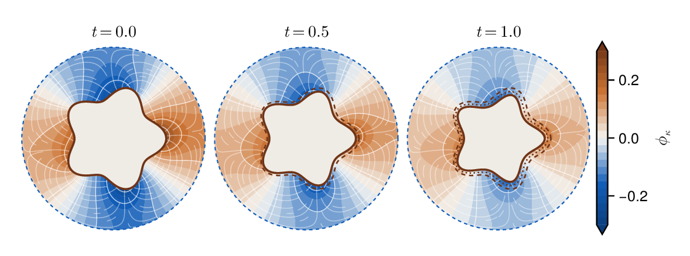
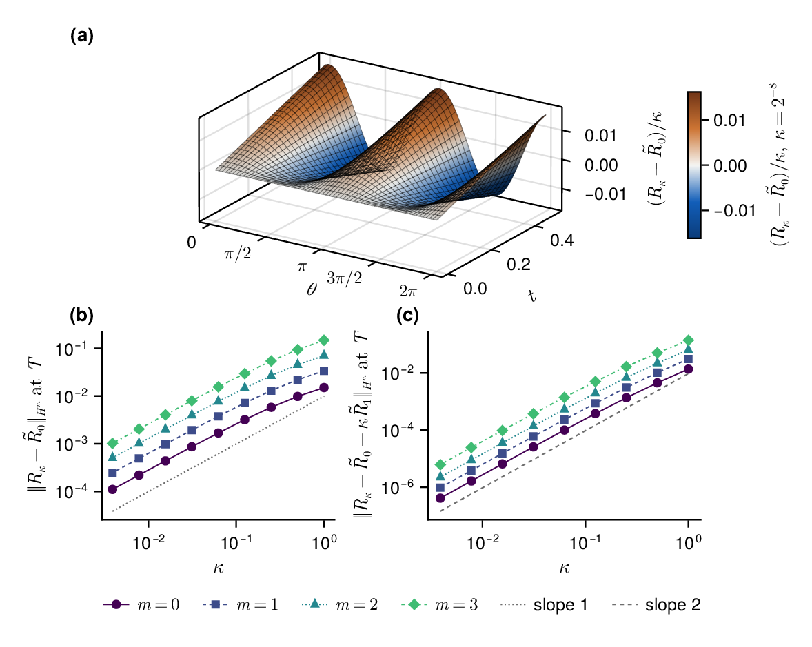

# A free boundary problem for a nonlinear electrochemical model

**Daniel Fernández · Denilson Menezes**

[Experiments](#the-experiments) · [Reproduce the results](REPRODUCING.md) · [Paper figures](figures/paper/) · [Citation](CITATION.cff)

A metal inclusion dissolves inside an insulated container. Its moving surface
is coupled to the electric potential in the surrounding electrolyte, but at
low conductivity the leading motion depends only on local material properties.

The paper establishes local well-posedness, justifies this limiting motion
while the interface remains smooth, and identifies the first electrical
correction. That correction redistributes dissolution along the surface
without changing its total on the same interface at first order.

<p align="center">
  <a href="figures/paper/fig_hero.pdf">
    
  </a>
</p>

*The coupled evolution. The potential is solved on a mesh fitted to the moving
surface; earlier interfaces are overlaid on the later snapshots. Click any
figure for its vector PDF.*

## The model and its limit

The potential is harmonic in the electrolyte $\Omega(t)=D\setminus\overline{S(t)}$.
The container wall is insulated, and the reactive interface
$\Gamma_*(t)=\partial S(t)$ satisfies

$$
\kappa\,\partial_\nu\phi_\kappa+i(x,\phi_\kappa)=0,
\qquad V_\nu=\beta\,d(x,\phi_\kappa),
\qquad i=d-r,
$$

where $\nu$ points into the solid and

$$
d(x,z)=i_0(x)e^{A_2(z-\phi_{\mathrm{eq}}(x))},
\qquad r(x,z)=i_0(x)e^{-A_1(z-\phi_{\mathrm{eq}}(x))}.
$$

As $\kappa\to0$, the interface potential approaches $\phi_{\mathrm{eq}}$ and
the leading velocity is $V_\nu=\beta i_0(x)$. On smooth time intervals the
interface error is $O(\kappa)$; subtracting the first corrector improves it to
$O(\kappa^2)$.

<p align="center">
  <a href="figures/paper/fig_corrector.pdf">
    
  </a>
</p>

*The limit and its corrector. The scaled displacement approaches the discrete
corrector; the errors follow first- and second-order laws across four Sobolev
norms. The radial corrector has the opposite sign to the inward normal-graph
corrector on a circle.*

## The experiments

The repository contains the Julia code, production data, four figures, and four
generated tables used in the paper's numerical section. Experiments E1, E2,
and E4 also support the checks reported in its text.

| Experiment | What it checks | Paper evidence |
| --- | --- | --- |
| E1 | Exact shrinking shapes, spatial and temporal refinement, boundary flux recovery | Setup and basic checks subsection |
| E2 | Charge and material balances, dissolution excess, lifetime barrier | Setup and basic checks subsection; [coupled evolution](figures/paper/fig_hero.pdf) |
| E3 | Frozen trace and energy expansions; sharpness for material profiles on a fixed boundary | [Transfer factor](figures/paper/fig_transfer.pdf); [frozen table](tables/frozen_expansion.tex) |
| E4 | Linearized growth rates and absence of mode damping | Setup and basic checks subsection |
| E5 | Limiting flow, electrical corrector, bulk convergence | [Corrector](figures/paper/fig_corrector.pdf), [bulk field](figures/paper/fig_bulk.pdf); [conductivity table](tables/conductivity_sweep.tex), [reference error budget](tables/refinement_budget.tex), [coupled refinement](tables/coupled_refinement.tex) |

## Quick start

The recorded environment uses **Julia 1.13.0**; dependency versions are pinned
in `Manifest.toml`.

```bash
git clone https://github.com/danielfdzm/free-boundary-corrosion.git
cd free-boundary-corrosion
julia --project=. -e 'using Pkg; Pkg.instantiate()'
julia --project=. scripts/check.jl
julia --project=. scripts/make_figures.jl
julia --project=. scripts/make_tables.jl
```

The included figures and tables can be regenerated from the archived data
without rerunning the experiments. New outputs go into `outputs/`. The
[reproduction guide](REPRODUCING.md) gives commands for fresh simulations and
explains the reference solutions.

## Repository guide

```text
free-boundary-corrosion/
├── src/                 finite elements, geometry, flows, experiments E1–E5
├── scripts/             experiment runner, paper plots, tables, checks
├── data/                production records and their paper correspondence
├── figures/paper/       the four manuscript PDFs
├── figures/previews/    browser previews of those same figures
├── tables/              the four generated manuscript tables
├── Project.toml
├── Manifest.toml
└── REPRODUCING.md
```

The numerical method uses fitted piecewise affine finite elements, Newton's
method for the nonlinear boundary reaction, Fourier differentiation of the
radial graph, and Heun time stepping. Start with
[`materials.jl`](src/materials.jl), [`fem.jl`](src/fem.jl), and
[`flows.jl`](src/flows.jl); [`experiments.jl`](src/experiments.jl) specifies the
reported runs.

The convergence plots distinguish matched discrete references, which isolate
the conductivity expansion, from refined references, which assess the
remaining discretization error.

Please cite **A free boundary problem for a nonlinear electrochemical model**,
by Daniel Fernández and Denilson Menezes, and this repository when using these
materials. See [`CITATION.cff`](CITATION.cff).
